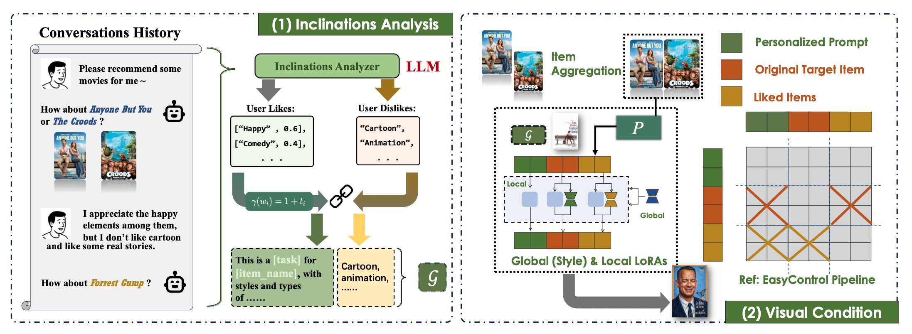
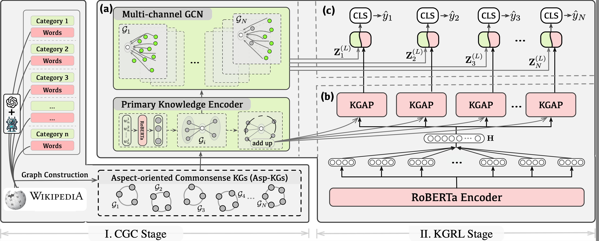








My name is Yupeng Han (韩玉鹏). I am currently a second-year Master's student (since Sepetember 2024) majoring in Computer Science and Technology at University of Science and Technology of China [(USTC)](https://www.ustc.edu.cn/), advised by A/Prof. [Zhenya Huang](http://staff.ustc.edu.cn/~huangzhy/) (黄振亚) & A/Res. [Kai Zhang](http://home.ustc.edu.cn/~sa517494/) (张凯). Prior to this, I obtained my Bachelor’s degree in Computer Science and Technology from Nanjing University of Finance and Economics [(NUFE)](https://www.nufe.edu.cn/) in 2024.

My research interest includes Multimodal Representation Learning, Large Language Models. I am fortunate to collaborate with researchers and have co-authored several papers presented at top-tier conferences, including NeurIPS, CIKM.

# 🔥 News
TBD

# 📝 Publications 

NeurIPS 2025

[Personalized Visual Content Generation in Conversational Systems](https://openaccess.thecvf.com/content_cvpr_2016/papers/He_Deep_Residual_Learning_CVPR_2016_paper.pdf)

Xianquan Wang, Zhaocheng Du, Huibo Xu, Shukang Yin, **Yupeng Han**, Jieming Zhu, Kai Zhang, Qi Liu

CIKM 2025

[Harnessing Commonsense: LLM-Driven Knowledge Integration for Fine-Grained Sentiment Analysis](https://openaccess.thecvf.com/content_cvpr_2016/papers/He_Deep_Residual_Learning_CVPR_2016_paper.pdf)

Kai Zhang, **Yupeng Han**

Arxiv

[Route to Reason: Adaptive Routing for LLM and Reasoning Strategy Selection](https://arxiv.org/pdf/2505.19435)

Zhihong Pan, Kai Zhang, Yuze Zhao, **Yupeng Han**

Arxiv

[From Entity Reliability to Clean Feedback: An Entity-Aware Denoising Framework Beyond Interaction-Level Signals](https://arxiv.org/pdf/2508.10851)

Ze Liu, Xianquan Wang, Shuochen Liu, Jie Ma, Huibo Xu, **Yupeng Han**, Kai Zhang, Jun Zhou

# 🎖 Honors and Awards
- *2023* Undergraduate National Scholarship, Ministry of Education of the People’s Republic of China. (本科生国家奖学金)
- *2022* The 17th National University Students Car Race First Prize (第十七届全国大学生智能汽车竞赛全国总决赛一等奖)
- *2022* 2022 China Robot Competition & RoboCup China Open Second Prize (2022中国机器人大赛暨RoboCup机器人世界杯中国赛总决赛全国二等奖)
-  *2022* 2022 China Robot Competition & RoboCup China Open Third Prize (2022中国机器人大赛暨RoboCup机器人世界杯中国赛专项赛全国三等奖)
- *2021* 2021 China Robot Competition & RoboCup China Open Third Prize (2021中国机器人大赛暨RoboCup机器人世界杯中国赛总决赛全国三等奖)
- *2024* Outstanding Graduates of Jiangsu Province's Ordinary Colleges and Universities. (江苏省优秀毕业生)

# 📖 Educations
- *2024.09 - present*, School of Computer Science and Technology, University of Science and Technology of China, Hefei, China. 
- *2020.09 - 2024.06*, School of Computer and Artificial Intelligence, Nanjing University of Finance and Economics, Nanjing, China. 

# 💬 Invited Talks
TBD
# 💻 Internships
TBD
